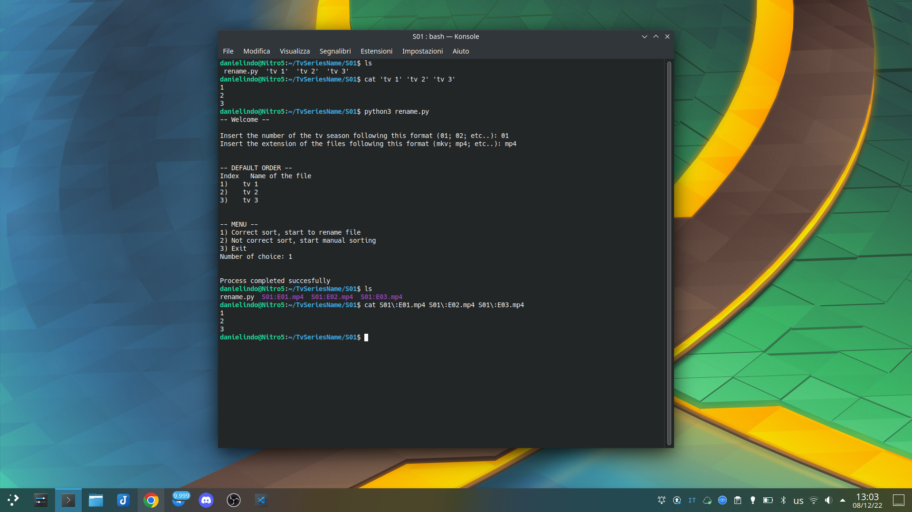

# tv-shows-renamer
- python script to rename all episode of TV Series in the fllowing example format: > S01:E01
- ⚠️ This scripts only works with **Linux**

</br>

# Purpose
I created this script to speed up the creation of Jellyfin Tv Shows folder structures, <br>
Jellyfin with the right folder structure can automatically scrape Tv Shows' metadata. <br>
More info can be found <a href="https://jellyfin.org/docs/general/server/media/shows">in the official jellyfin documentation</a>

```bash

Shows
├── Serie1
│   ├── S01
│   │   ├── S01E01.mkv
│   │   └── S01E02.mkv
│   ├── S02
│   │   ├── S01E01.mkv
│   │   ├── S01E02.mkv
│   │   └── S01E03.mkv
│   └── S03
│       ├── S03E01.mkv
│       └── S03E02.mkv
└── Serie2
    ├── S01E01.mkv
    ├── S01E02.mkv
    ├── S02E01.mkv
    └── S02E02.mkv

```

</br>

# Instruction and requirements
- requirements
  - Python3.8 or newer
  - > The os library is instelled by default with python
- instruction
  - move the 'rename.py' file in the folder with the episode to rename
  - run the file using ```foo@bar:~$ python3 rename.py```
  - then insert the required data ```Insert the number of the tv season following this format (01; 02; etc..):    ```
> ⚠️ **do not rename the file!**

</br>

# Screenshot

